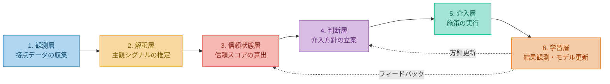

# subjective-trust-platform

実店舗におけるブランド信頼を、顧客主観の観測・解釈・改善ループで再構築するためのシステム設計基盤。

© 2026 Kazuaki Watanabe / 渡邉和明 — Code: [MIT](./LICENSE-MIT) / Docs: [CC BY-NC 4.0](./LICENSE-CC-BY-NC)

---

## これは何か

ブランド信頼は、売上や認知度とは異なる。信頼とは、「このブランドは期待を裏切らない」という消費者の主観的確信である。

実店舗は、その信頼が最も濃く形成され、同時に最も毀損されやすい場である。にもかかわらず、実店舗における信頼の観測は体系的に行われていない。POSデータは購買結果を記録するが、購買に至る過程——消費者がどう感じ、なぜそう受け取ったか——は記録しない。

本リポジトリは、この問題に対する設計基盤を提供する。

---

## 現在のステータス: Phase 1 実装完了

Phase 1（Python 単独 PoC）の全 16 タスクの実装が完了し、145 件のユニットテストが PASS している。

### 実装済みコンポーネント

| カテゴリ | 内容 |
|---|---|
| **インフラ・基盤** | Docker 環境（api/db/worker）、pyproject.toml、pydantic Settings、SQLAlchemy 全 10 テーブル、Alembic マイグレーション |
| **AI 解釈パイプライン** | 抽象クライアント（Mock/Anthropic/Bedrock 切替）、プロンプトテンプレート（PROMPT_VERSION 管理）、日次バッチ（PII マスキング、スロットリング） |
| **スコア算出** | 5 次元重みテーブル + recency_decay 4 段階、dimension_score 算出、TrustScoreSnapshot 生成、コールドスタート対応 |
| **REST API** | `POST /visits`（接客タグ入力）、`POST /feedback`（アンケート受信）、`GET /stores/{id}/scores`（スコア参照）、`GET /stores`（店舗一覧） |
| **バッチ・運用** | POS 日次連携（冪等性保証）、ルールベース TrustEvent 自動生成、週次レポート自動生成、4 種アラート閾値判定 |

### クイックスタート

```bash
# Docker で起動
docker compose up --build -d

# デモデータ投入
docker compose exec api python scripts/seed_demo.py

# Swagger UI をブラウザで開く
# http://localhost:8080/docs
```

詳細なデモ手順は [docs/demo-guide.md](./docs/demo-guide.md) を参照。

---

## 中核概念

**「信頼は主観の業務表現である」**

ブランド運営で使う「信頼」は抽象語に見えるが、実態は顧客主観の積み重ねである。

- この店なら安心して相談できる
- 自分に合わないものを無理に勧めてこない
- 商品説明に納得できる
- 欠品時も誠実に対応してくれる
- このブランドは世界観がぶれていない

これらはすべて消費者の主観的判断であり、本システムはこの主観を構造的に観測し、AIで解釈し、改善ループを回す。

---

## 信頼の5次元

ブランド信頼を以下の5次元に分解して観測する。

| 次元 | 問い |
|---|---|
| **商品信頼** | 期待した品質・価格納得感があるか |
| **接客信頼** | 安心して相談でき、不快な思いをしないか |
| **提案信頼** | 自分に合った提案がされているか |
| **運営信頼** | 在庫・案内・受取に齟齬がないか |
| **物語信頼** | ブランドらしさと一貫性が保たれているか |

売上が好調でも特定の次元で信頼が毀損されていることがある。総合指標だけでは見えない問題を、次元ごとに分解して検知する。

---

## 顧客主観の三層モデル

同じ接客でも、消費者によって受け取り方は異なる。この差異を構造化するために、顧客主観を3層で捉える。

**Trait** — 長期的な価値観・選好。「品質重視」「押し売りを嫌う」など。来店をまたいで安定している。

**State** — 来店時の短期的状態。「今日は下見だけ」「ギフトで失敗したくない」など。来店ごとに変わりうる。

**Meta** — 違和感・修正の履歴。「前回の接客が合わなかった」「欠品対応で不信感が残っている」など。信頼毀損の伏線として機能する。

---

## アーキテクチャ

観測から改善までを6層構造で設計する。



Phase 1では観測層・解釈層・信頼状態層を構築し、Phase 3以降で判断層（Agent構成）・介入層・学習層を段階的に接続する。

---

## 段階的導入

| Phase | 期間 | 内容 | 状態 |
|---|---|---|---|
| **Phase 1** | 3ヶ月 | 直営5店舗。POS連携、接客タグ入力（10秒以内）、ミニアンケート、AI解釈、店舗ダッシュボード、週次レポート | **実装完了** |
| **Phase 2** | +3ヶ月 | 全直営店に拡大。外部レビュー連携、本部分析画面、アラート、店舗間比較、SubjectiveProfile試験構築 | 未着手 |
| **Phase 3** | +6ヶ月〜 | Trust API、Agent構成（判断層）、介入の半自動化、フィードバックループ、施策の因果仮説管理 | 未着手 |

---

## 技術スタック

### Phase 1（実装済み）

| 用途 | 技術 |
|---|---|
| Web フレームワーク | FastAPI |
| ORM / DB | SQLAlchemy 2.x + asyncpg / PostgreSQL 15 |
| バリデーション | pydantic v2 |
| AI 解釈 | anthropic SDK / boto3（Bedrock）/ Mock クライアント |
| データ集計 | polars |
| テスト | pytest + pytest-asyncio（145 テスト） |
| 型チェック | mypy（strict モード） |
| フォーマッタ | ruff |
| コンテナ | Docker Compose（api + db + worker） |

### Phase 2 以降（予定）

| 用途 | 技術 |
|---|---|
| 業務本体 | ASP.NET Core Minimal API（.NET 8 / C#） |
| キュー連携 | SQS / Cloud Pub/Sub |
| フロントエンド | Next.js（店舗ダッシュボード） |

---

## ドキュメント構成

```
subjective-trust-platform/
├── README.md                             ← 本ファイル
├── CLAUDE.md                             ← Claude Code 向け実装ガイド
├── AGENTS.md                             ← Agent 向け作業ガイド（最上位ルール）
├── task/
│   └── task-phase1.md                    ← Phase 1 実装タスクリスト
├── docs/
│   ├── whitepaper-brand-trust.md         ← ホワイトペーパー：信頼の理論的根拠
│   ├── trust-observation-system-v1.md    ← 設計書v1：Phase 1の実装設計
│   ├── architecture-overview.md          ← アーキテクチャ設計書：Phase 3以降の全体構造
│   ├── demo-guide.md                     ← デモ手順書
│   └── language_selection_report.md      ← 言語・技術選定の判断根拠
├── src/python/                           ← Phase 1 実装（Python）
├── tests/python/                         ← テスト・evidence
└── scripts/
    └── seed_demo.py                      ← デモデータ投入スクリプト
```

| ドキュメント | 読者 | 目的 |
|---|---|---|
| ホワイトペーパー | 全般（公開） | ブランドにおける信頼の位置づけを学術的根拠に基づいて論証する |
| 設計書v1 | 開発チーム・PdM | Phase 1（5店舗PoC）のデータモデル、入力設計、AI解釈、画面設計、KPIを定義する |
| アーキテクチャ設計書 | 開発チーム・アーキテクト | Phase 3以降のAgent構成、Trust API、フィードバックループを定義する |
| デモ手順書 | 開発チーム・関係者 | ローカルでのデモ環境構築・操作手順 |

---

## 主要な設計判断

**監視ではなく改善支援**: 本システムは店舗スタッフを監視するツールではない。ブランド信頼を観測し、改善に役立てる支援基盤として設計する。個人査定の直接材料にしない。

**予測ではなく解釈**: AIの役割は「再来店するか」の予測ではなく、「なぜそう感じたか」の解釈にある。改善の方向性を示すには、予測の手前にある主観的解釈を構造化する必要がある。

**売上と信頼の分離**: 売上は信頼の遅行指標にすぎない。短期売上最適化（過度な値引き、プッシュ型接客）が信頼を毀損するケースを検知するために、信頼KPIは売上KPIとは独立に追跡する。

**AI出力はすべて仮説**: AI解釈の結果は確定判断として扱わない。confidence閾値による人間レビュー、週次の精度検証、誤分類フィードバック導線を設計に組み込む。

**現場負荷の最小化**: 接客タグ入力は最小2タップ・10秒以内で完了する設計。長文入力を強制しない。

---

## subjective-agent-architecture との関係

本リポジトリは、[subjective-agent-architecture](https://github.com/KazuakiWatanabe/subjective-agent-architecture) の応用プロジェクトである。

`subjective-agent-architecture` は、AIの役割を予測ではなく **Interpretation Layer（解釈層）** に置き、主観を Trait / State / Meta の三層で構造化し、意思決定と実行に接続する基盤を定義している。

本リポジトリは、その基盤を **ブランド信頼** という業務課題に適用したものである。

| subjective-agent-architecture | subjective-trust-platform |
|---|---|
| 主観の構造化・解釈・意思決定接続の基盤設計 | 顧客主観から信頼を観測し、改善ループを回す実店舗向け実装 |
| Trait / State / Meta の概念定義 | Trait / State / Meta を接客タグ・アンケート・AI解釈で観測する設計 |
| Interpretation Layer の位置づけ | AI解釈パイプラインとして実装（Claude API Sonnet） |
| Feedback Flywheel | 信頼スコア→改善施策→再観測の改善ループ |

---

## ライセンス

本リポジトリはデュアルライセンスです。

| 対象 | ライセンス |
|---|---|
| プログラム（ソースコード） | [MIT License](./LICENSE-MIT) |
| ドキュメント（`docs/` 配下） | [CC BY-NC 4.0](./LICENSE-CC-BY-NC) |

ソースコードは商用・非商用を問わず自由に利用できます。ドキュメントは非営利目的での利用・改変・再配布を許可します。ドキュメントの商用利用についてはお問い合わせください。
