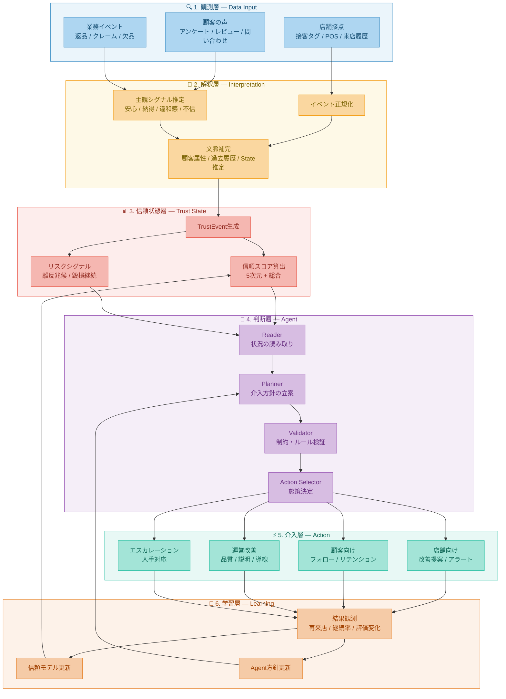

# Subjective Trust Platform アーキテクチャ設計書

© 2026 Kazuaki Watanabe / 渡邉和明 — Licensed under [CC BY-NC 4.0](./LICENSE)

---

## 1. 本書の位置づけ

本書は、信頼観測システム設計書（v1）のPhase 3以降を射程に、観測・解釈・信頼状態管理に加えて **判断・介入・学習** の各層を含む全体アーキテクチャを定義する。

設計書v1はPhase 1（直営5店舗でのPoC）を対象とし、観測層・解釈層・信頼状態層の設計に集中している。本書はその延長線上で、信頼状態に基づく介入判断とフィードバック学習を含む閉ループ構造を設計する。

**本書は将来設計であり、Phase 1の実装スコープには含まない。** Phase 1〜2の安定稼働を前提として、段階的に接続する。

### ドキュメント体系

| ドキュメント | 対象 | 主な読者 |
|---|---|---|
| ホワイトペーパー | 信頼の理論的根拠 | 全般（公開） |
| 設計書v1 | Phase 1の実装設計 | 開発チーム・PdM |
| 本書（アーキテクチャ設計書） | Phase 3以降の全体構造 | 開発チーム・アーキテクト |

---

## 2. 全体構成

### 2.1 6層アーキテクチャ



### 2.2 設計書v1との対応

| 層 | 設計書v1での対応 | 本書での拡張 |
|---|---|---|
| 観測層 | POS連携、接客タグ入力、ミニアンケート、外部レビュー（§5） | 変更なし |
| 解釈層 | AI解釈パイプライン、Claude API Sonnet（§3.2-3.3） | 文脈補完モジュールの追加 |
| 信頼状態層 | TrustEvent、TrustScoreSnapshot（§4） | リスクシグナルの体系化 |
| 判断層 | 週次レポート、アラート、改善提案（§6-7） | Agent構成への移行 |
| 介入層 | 店長による手動実行（§9） | 自動化・半自動化の導入 |
| 学習層 | 重みテーブルの四半期見直し（§2.4） | 継続的フィードバックループ |

設計書v1のPhase 1では、判断層は「AIが改善提案を生成し、店長が判断・実行する」構造である。本書で定義するAgent構成は、この判断プロセスを構造化・部分自動化するものであり、Phase 1の構造を否定するものではなく、その発展形として位置づける。

---

## 3. コンポーネント設計

### 3.1 観測層

設計書v1の§5（入力設計）をそのまま引き継ぐ。Phase 3での追加要素は以下。

**EC行動データ連携**: 来店前のEC閲覧履歴を取得し、来店時の期待値推定に活用する。設計書v1のPhase 3で言及されている「EC連携による来店前期待値の把握」に対応する。

### 3.2 解釈層

#### イベント正規化（Normalizer）

各データソースから取得したイベントを共通フォーマットに変換する。

```json
{
  "event_id": "evt_001",
  "store_id": "store_a",
  "customer_id": "cust_123",
  "event_type": "feedback_submitted",
  "channel": "line_survey",
  "timestamp": "2026-03-19T10:00:00+09:00",
  "payload": {
    "score_consultation": 2,
    "score_revisit": 3,
    "free_comment": "説明が不十分で不安が残った"
  }
}
```

#### 主観シグナル推定（Subjective Mapper）

設計書v1のAI解釈パイプライン（§3.3）を拡張する。設計書v1では自由記述の分類に限定していたが、本書では構造化データ（接客タグ、POS、来店パターン）からも主観シグナルを推定する。

出力スキーマは設計書v1の`subjective_hints`を発展させたもの。

```json
{
  "event_id": "evt_001",
  "signals": [
    {
      "label": "explanation_insufficient",
      "trust_dimension": "service",
      "sentiment": "negative",
      "severity": 2,
      "confidence": 0.82,
      "evidence": "free_comment: 説明が不十分で不安が残った"
    }
  ],
  "context": {
    "trait_signal": null,
    "state_signal": "比較検討中の可能性（score_revisit=3）",
    "meta_signal": "前回来店時も接客信頼スコアが低下傾向"
  }
}
```

#### 文脈補完（Context Enrichment）

単一イベントでは判断できない文脈を補完する。設計書v1のPhase 2で蓄積されるSubjectiveProfileの活用がここに対応する。

補完項目: 顧客のTrait要約（Phase 2で蓄積）、直近来店履歴、購買カテゴリ傾向、過去のTrustEvent履歴、店舗の現在の信頼スコア水準。

### 3.3 信頼状態層

設計書v1のTrustEvent生成（§2.3）とスコア算出（§2.4）をそのまま基盤とする。本書での追加は以下。

#### リスクシグナル体系

設計書v1のアラート設計（§7）を構造化し、以下のリスクシグナルを定義する。

| シグナル | 定義 | トリガー条件 |
|---|---|---|
| churn_risk | 離反兆候 | 再来店意向が3週連続低下 |
| trust_erosion | 信頼毀損継続 | 任意の次元スコアが4週連続低下 |
| incident_cluster | 負イベント集中 | 同一次元のネガティブイベントが1週間に5件超 |
| recovery_stall | 回復停滞 | 改善施策実行後4週経過してもスコア回復なし |

#### Trust API

信頼状態を判断層および外部システムから参照可能にする。

```
GET  /trust/stores/{store_id}/snapshot          → 最新スコア
GET  /trust/stores/{store_id}/history           → スコア推移
GET  /trust/stores/{store_id}/events            → TrustEvent一覧
GET  /trust/stores/{store_id}/risks             → アクティブなリスクシグナル
GET  /trust/customers/{customer_id}/profile     → SubjectiveProfile（Phase 2以降）
```

### 3.4 判断層（Agent構成）

#### 設計原則

判断層のAgentは、応答を生成する汎用チャットボットではない。信頼状態とリスクシグナルを入力として、**何をすべきか（あるいはすべきでないか）を判断する意思決定支援モジュール** である。

Phase 3の初期段階では、Agentの出力はすべて **提案** であり、実行には人間の承認を要する。完全自動実行への移行は、提案の採用率と結果の検証を十分に行った後に段階的に進める。

#### Reader Agent

信頼状態層の出力を読み取り、「いま何が起きているか」を構造化された要約として生成する。

入力: 店舗のTrustScoreSnapshot、アクティブなリスクシグナル、直近のTrustEvent群。

出力: 状況要約（自然言語）、注目すべき変化点のリスト、Planner Agentへの構造化入力。

設計書v1の「今週のAI要約」（§6.1）を、Agent化したものと位置づけられる。

#### Planner Agent

Reader Agentの出力を受けて、介入方針を立案する。

入力: Readerの状況要約、対象店舗・顧客の文脈情報、過去の介入履歴と結果。

出力: 推奨アクション候補（最大3件）、各候補の根拠と期待効果、介入しない場合のリスク見積もり。

設計書v1の「改善提案」（§6.1, §6.3）を、根拠と代替案を含む構造化提案に発展させたもの。

#### Validator Agent

Plannerの提案が、ブランド方針・業務制約・安全基準に適合するかを検証する。

検証項目: ブランドガイドラインとの整合性、予算・配信頻度の上限、個人情報取り扱いルール、高リスク対応における人手レビュー要否、設計書v1の§8（プライバシー・データガバナンス）で定義した制約への準拠。

#### Action Selector

検証済みの提案を、実行先に振り分ける。

振り分け先: 店舗ダッシュボード（店長への改善提案）、週次レポート（アラート追加）、顧客フォロー（LINE配信等）、エスカレーション（本部・人手対応）。

### 3.5 介入層

Phase 3初期の介入は、設計書v1の出力系（§6）を拡張する形で実装する。

| 介入種別 | Phase 1（設計書v1） | Phase 3（本書） |
|---|---|---|
| 店舗向け改善提案 | 週次レポートに記載 | ダッシュボードでリアルタイム表示 + 優先度付き |
| アラート | メール/Slack配信 | リスクシグナルに連動した自動生成 |
| 顧客フォロー | 対象外 | 信頼低下顧客への個別フォロー提案 |
| 運営改善 | 店長が手動判断 | Agent提案 + 人間承認の半自動化 |

### 3.6 学習層

#### 結果観測（Outcome Tracker）

介入実行後の変化を追跡する。

追跡指標: 再来店有無・間隔、信頼スコアの変化、アンケート回答の変化、返品・クレームの発生有無、外部レビューの変化。

追跡期間: 介入後4週間を基本とし、施策種別に応じて延長する。

#### 信頼モデル更新

設計書v1では重みテーブルを四半期ごとに手動見直しする設計としている（§2.4）。学習層では、Outcome Trackerの結果を用いて重みの調整候補を自動提案し、人間がレビュー・承認する半自動プロセスに移行する。

#### Agent方針更新

介入の採用率・有効性に基づいて、Planner Agentのプロンプトおよびルールを更新する。更新はバージョン管理し、変更履歴を残す（設計書v1 §8.3の方針を踏襲）。

---

## 4. 段階的導入計画

| 段階 | 前提 | 追加される層 |
|---|---|---|
| Phase 1（設計書v1） | — | 観測層、解釈層、信頼状態層（基本） |
| Phase 2（設計書v1） | Phase 1の安定稼働 | 解釈層の精緻化、リスクシグナル基本版 |
| Phase 3a | Phase 2のデータ蓄積 | Trust API、Reader Agent、Planner Agent（提案のみ） |
| Phase 3b | Phase 3aの提案採用率検証 | Validator Agent、Action Selector、介入層（半自動） |
| Phase 3c | Phase 3bの介入結果検証 | 学習層、フィードバックループ |

各段階の移行判定基準は、前段階の運用KPI達成と、新機能のPoC検証結果に基づく。

---

## 5. 設計原則

**5.1 信頼は動的状態である**: 信頼スコアは固定値ではなく、イベントと文脈に応じて更新され続ける。

**5.2 解釈は説明可能であるべき**: 「なぜ信頼スコアが下がったのか」を根拠とともに提示できない推定は、実運用に耐えない。

**5.3 Agentは判断補助器である**: 本アーキテクチャにおけるAgentの中心価値は、文章生成ではなく、介入判断と業務接続にある。

**5.4 閉ループで改善する**: アクション実行後の結果を観測し、信頼モデルとAgent方針を更新することで、継続的に改善する。

**5.5 人間レビューを前提とする**: 高リスク対応や説明責任が伴う介入では、Agent単独完結ではなく、人間の判断を介在させる。Phase 3初期ではすべてのAgent出力に人間承認を要する。

**5.6 Phase 1の設計を壊さない**: 本書のアーキテクチャは設計書v1の構造を前提とし、その上に層を重ねる形で拡張する。Phase 1のテーブル設計・入力設計・スコア算出ロジックは変更しない。

---

## 6. まとめ

本書は、信頼観測システムの全体アーキテクチャを、観測・解釈・信頼状態・判断・介入・学習の6層構造として定義した。

設計書v1が実現する「信頼の可視化と改善提案」を基盤として、判断層（Agent構成）と学習層（フィードバックループ）を段階的に接続することで、信頼の観測から介入・改善までを一気通貫で回す運用基盤を構築する。

導入はPhase 3を3段階に分割し、提案のみ→半自動化→フィードバックループの順で進める。各段階で人間レビューを前提とし、Agentの有効性を検証したうえで自動化の範囲を拡大する。
