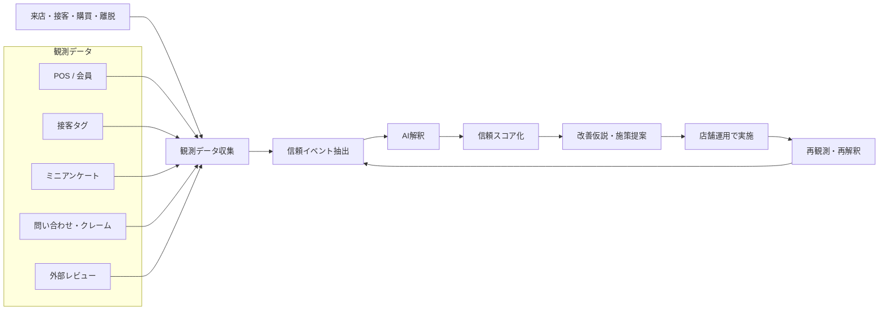
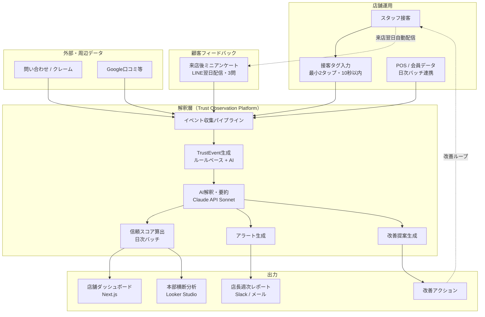
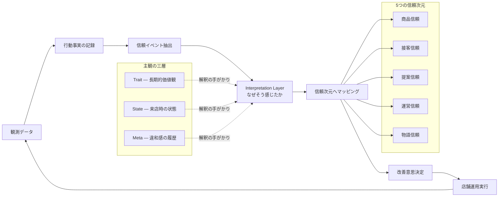
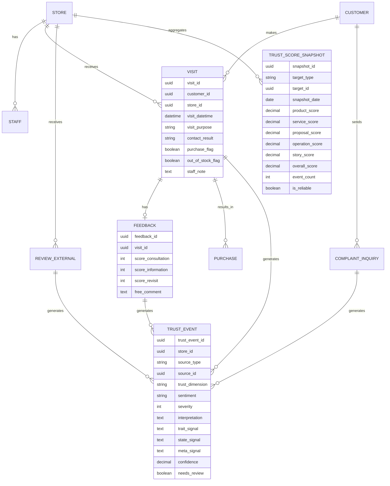

# Trust Observation System v1 補足資料

## 1ページ要約版 + Mermaid全体アーキテクチャ図

© 2026 Kazuaki Watanabe / 渡邉和明 — Licensed under [CC BY-NC 4.0](./LICENSE)

---

# 1. 1ページ要約版

## 名称

**実店舗向け信頼観測システム（Trust Observation System）**

## 背景

ECではクリック、離脱、購買などの行動ログが自然に蓄積される一方、実店舗ではブランド信頼が形成・毀損される重要な瞬間が十分に観測されていない。売上や日報だけでは「なぜ信頼されたのか / なぜ不信が生まれたのか」が見えない。

本システムは、実店舗接点における顧客の主観を観測し、AIで解釈し、ブランド信頼の改善につなげるための運用基盤である。設計書では信頼を「主観の業務表現」として扱い、顧客主観の三層モデル（Trait / State / Meta）と接続している（設計書 §2.2）。

## 一言でいうと

**「信頼は主観の業務表現である」**

実店舗における安心・納得・違和感・不信を観測し、AIで解釈・要因分析・改善提案までつなげる。

## 解決したい課題

- 接客後に離脱した理由が分からない
- 欠品時対応がブランド印象にどう影響したか見えない
- 売上は出ていても再来店意向が落ちている
- 店舗ごとにブランド体験がばらつく
- 良い接客が属人化し、再現できない

## 価値

**現場**: 今週どの次元で信頼が毀損したかを把握でき、改善すべき接客・運営論点が分かる。

**本部**: 店舗横断で信頼スコアや論点を比較でき、売上だけでは見えないブランド毀損の兆候を把握できる。

**ブランド運営**: 「ブランドらしさ」の毀損要因を継続観測でき、短期売上と中長期信頼を切り分けて判断できる。

## 観測対象

**主要入力**: POS / 会員データ、接客タグ入力、来店後ミニアンケート、問い合わせ / クレーム、Google口コミなど外部レビュー。

**主な観測テーマ**: 押し売り感、説明不足、丁寧さ、提案の的確さ、欠品時対応、在庫案内不一致、ブランドらしさ、また相談したいか、また来店したいか。

## AIの役割

AIは予測ではなく **解釈** を担う。「何が起きたか」の先にある「なぜそう感じたか」を構造的に読み解く（設計書 §3.1）。

具体的には、自由記述の信頼次元分類と感情分析、「なぜそう感じたか」の解釈仮説生成、Trait / State / Metaの手がかり抽出、信頼毀損・形成の兆候検知と週次要約、改善仮説の提示と成功店舗の共通点抽出を行う。

AI出力はすべて仮説提示であり、確定判断として扱わない。confidenceが0.6未満の場合は人間レビューキューに回す（設計書 §3.3）。

## 5つの信頼次元

- **商品信頼**: 品質・価格納得感・期待一致
- **接客信頼**: 安心して相談できるか
- **提案信頼**: 自分に合った提案か
- **運営信頼**: 在庫・案内・受取に齟齬がないか
- **物語信頼**: ブランドらしさ・世界観の一貫性

## PoCスコープ（Phase 1）

- 対象: 直営5店舗
- 入力: 接客タグ入力（最小2タップ、10秒以内）、ミニアンケート（LINE配信、3問）、POS日次連携
- 出力: 店舗別ダッシュボード、週次レポート自動配信、基本アラート
- 目標: 信頼毀損要因の可視化と、改善アクションの定着
- コールドスタート: 最初の4週はスコア算出せず、データ蓄積とAI分類精度の検証に集中（設計書 §2.5）

## Phase 1の非対象

- リアルタイム接客支援
- スタッフ個人査定用途
- 顧客ごとのTrait確定推定（手がかり蓄積のみ）
- 音声会話の自動常時収集
- 高度な個人最適レコメンド

## 主要KPI

**運用KPI**: 接客タグ入力率（目標70%）、アンケート回答率（目標15%）、AI分類精度・次元（目標85%）、AI分類精度・感情（目標90%）、店長レポート確認率（目標80%）。

**成果KPI**: 再来店意向率、接客後離脱率、欠品起因離脱率、リピート来店率（Phase 2〜）、返品率（Phase 2〜）、外部レビュー平均評価（Phase 2〜）。

KPIの目標値と計測方法の詳細は設計書 §11を参照。

## 期待効果

**短期**: 信頼毀損要因の可視化、欠品・接客・説明不足の初動改善。

**中期**: 店舗ごとの差分把握、良い接客の標準化、再来店意向の改善。

**長期**: ブランド再生の継続改善基盤化、短期売上ではなく信頼KPIを軸にした運営への転換、SubjectiveProfileを活用した接客前コンテキスト提供（Phase 3〜）。

---

# 2. Mermaidアーキテクチャ図

## 2.1 説明用サマリー図

全体のデータフローと改善ループを示す。非技術者への説明に使う。

## 2.2 システム構成図（PoC向け）

入力・処理・出力の具体的な構成を示す。PoC企画の説明に使う。

## 2.3 解釈層を強調した図

主観アーキテクチャとの接続を示す。「信頼は主観の業務表現である」というコンセプトの説明に使う。

## 2.4 データモデル関係図（簡略版）

設計書 §4のER構造の簡略版。設計レビューに使う。

---

# 3. 使い分けガイド

**会話・概要説明**: 2.1 説明用サマリー図を使う。非技術者にも全体像が伝わる。

**PoC企画説明**: 2.2 システム構成図を使う。入力・解釈層・出力の具体構成が一目で分かる。

**主観アーキテクチャとの接続説明**: 2.3 解釈層強調図を使う。Trait / State / Metaと信頼5次元の関係が伝わる。

**設計レビュー**: 2.4 データモデル関係図を使う。TrustEventを中心としたER構造の簡略版として扱える。

---

# 4. 一言まとめ

**実店舗向け信頼観測システムは、売上分析ツールではなく、顧客主観を解釈してブランド信頼を改善するための運用基盤である。**
